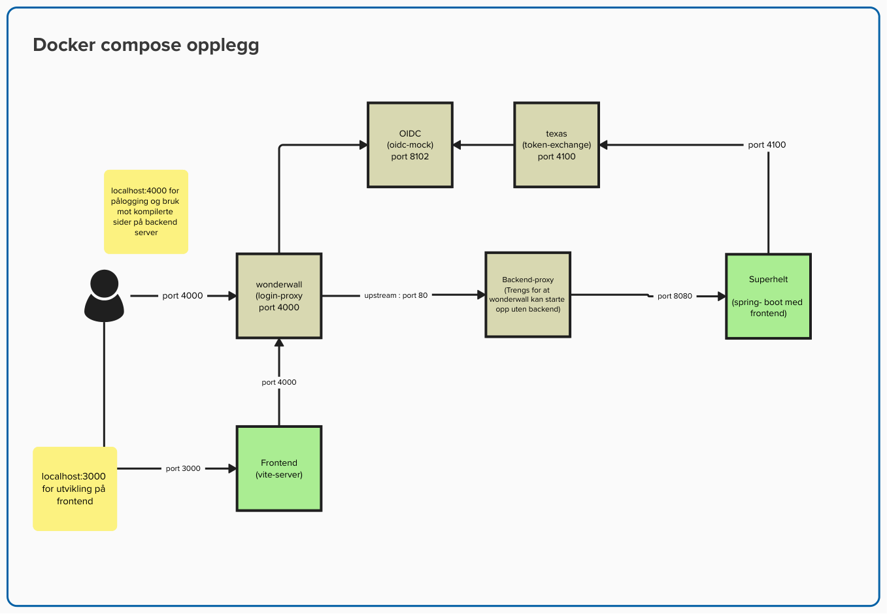

# Super app

Saksbehanding og Utbetaling På Enkle Regler

## Lokal utvikling


### Tjenester som appen trenger
```shell
docker-compose up
```
### Backend
Start backend i ved å kjøre [DevApplication.kt](./backend/src/test/kotlin/no/nav/historisk/superapp/DevApplication.kt) i IDE

Appen er da tilgjengelig på http://localhost:4000 med pålogging via wonderwall. Frontend blir oppdatert ved bygg av frontend

### Frontend
```shell
# i /frontend
npm start 
```

Appen er da tilgjengelig på http://localhost:3000 med hot reload, devtools mm ++
Pålogging må skje via http://localhost:4000

