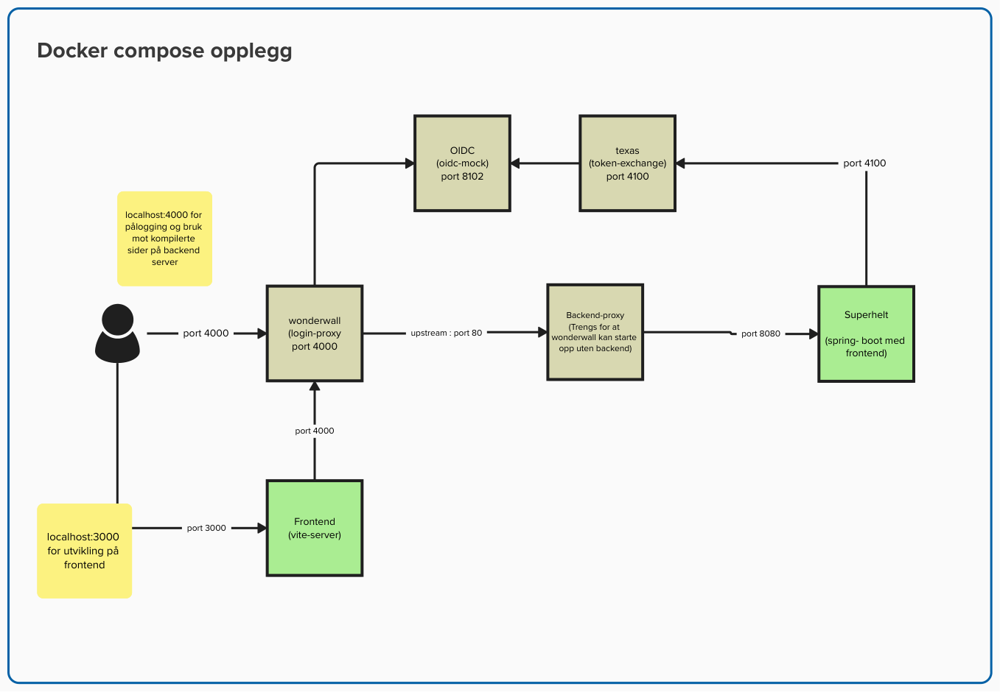

# Superhelt

Saksbehandling og engangsutbetaling på enkle helseytelser. Erstatter InfoTrygd-rutiner HT-MV, SB-SA og GE-PP.

> Alle trenger hjelp av en superhelt en gang i blant

## Stønader som støttes
- Ortoser
- Parykk
- Fottøy
- Proteser
- Reiseutgifter

## Arkitektur

```
root (Maven multi-module)
├── backend/    Spring Boot + Kotlin – REST API, Kafka, JPA
├── frontend/   React 19 + TanStack Router/Query + Nav Aksel DS
├── libs/       Interne Kotlin-biblioteker (common-types, pdl, helved, tilgangsmaskin, dokarkiv, oppgave, pdfgen)
├── mocks/      Mock-server + mock-oidc for lokal utvikling
├── pdfgen/     Brevgenerator (Docker)
└── e2e/        Playwright-tester (kjøres mot kjørende app)
```

### Saksflyten

1. Saksbehandler oppretter **Sak** → fyller inn opplysninger → sender til attestering
2. Attestant attesterer → sak ferdigstilles → **Vedtak** lagres
3. Ved innvilgelse sendes **Utbetaling** til Helved via Kafka (`historisk.utbetaling.v1`) og vedtaket journalføres i Dokarkiv og distribueres
4. Helved returnerer utbetalingsstatuser tilbake på `helved.status.v1`

**Auth:** Azure AD via Nais Wonderwall (sidecar). Lokalt kjøres mock-oidc + Wonderwall i Docker.



## Lokal utvikling

### Oppstartsrekkefølge

**1. Start avhengigheter (Postgres, Kafka, Wonderwall, mock-oidc):**
```shell
docker compose up
```

**2. Start backend** ved å kjøre [DevApplication.kt](./backend/src/test/kotlin/no/nav/historisk/superhelt/DevApplication.kt) i IDE.

Appen er tilgjengelig på http://localhost:4000 (gjennom Wonderwall med mock-auth).

**3. Start frontend:**
```shell
# i /frontend
npm start
```

Frontend er tilgjengelig på http://localhost:3000 med hot reload.  
Innlogging skjer via http://localhost:4000 (Wonderwall håndterer auth – `:3000` alene vil ikke fungere).

### Tester

**Backend** – krever Docker kjørende (TestContainers):
```shell
mvn test
```
For Colima på Mac, se https://golang.testcontainers.org/system_requirements/using_colima/

**Frontend:**
```shell
# i /frontend
npm run test
```

**E2E** – krever at hele appen kjører:
```shell
# i /e2e
npx playwright test        # headless
npx playwright test --ui   # med UI
```
Se [e2e/README.md](./e2e/README.md) for mer om Playwright-oppsett.

### Testpersoner

Mock-serveren har forhåndsdefinerte testpersoner. Se [mocks/mock-server/README.md](./mocks/mock-server/README.md) for fullstendig oversikt.

### Formatering og linting (frontend)

```shell
# i /frontend
npm run biome        # sjekk
npm run biome:write  # sjekk og skriv endringer
```
